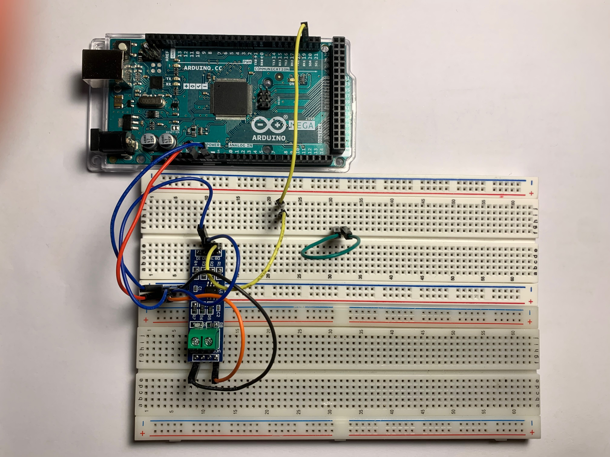

# DmxReader

## Ziel 
Das Ziel von diesem Projekt ist die Entwicklung eines Gerätes, welches DMX-Protokolle auslesen kann. Für den Hauptcomputer wird ein Raspberry Pi verwendet.

## Theoretischer Hintergrund
### DMX
DMX (digital Multiplex) ist ein Kommunikationsprotokoll, das vor allem in der Eventtechnik-Industrie verwendet wird. Grundsätzlich wird die Kommunikation in sogenannte DMX-Unversen aufgeteilt. In einem Universum können 512 Kanäle angesteuert werden. Ein Kanal kann alle Werte eines 8-bit (0-255) Integers beinhalten.

### Serielle Datenübertragung 
Unter serieller Datenübertragung versteht man das verschicken von Daten über genau einen Draht. Anders als bei der parallelen Datenübertragung werden die Daten hintereinander übertragen (die parallele Datenübertragung braucht daher mehere Drähte). Diese Übertragung ist extrem effizient und erlaubt sehr hohe Taktraten. 
*Quelle: https://de.wikipedia.org/wiki/Serielle_Datenübertragung*

*Abbildung 1: Unterschied zwischen paralleler und serieller Datenübertragung*

Für dieses Projekt ist diese Art der Datenübertragung wichtig, da sie zur Kommunikation zwischen dem Raspberry Pi und dem Arduino Mega verwendet wird. Zudem werden die DMX-Signale über einen seriellen Datenbus eingelesen.

## Umsetzung 

## Funktionsweise
Da der Raspberry Pi keine DMX-Signale einlesen kann, musst ich einen Arduino Mega zur Hilfe nehmen. Dieser kann DMX einlesen. Zudem verfügt er über die Fähigkeit die eingelesenen Daten über eine Serial-Kommunikation dem Raspberry Pi zu schicken.
Der genau Ablauf sieht so aus:

1. Der Raspberry Pi liest den Input eines Textfeldes aus.
2. Diese Zahl wird über die Serial-Kommunikation zum Arduino geschickt.
3. Der Arduino liest, die dem Index entsprechende Adresse aus.
4. Anschliessend wird diese Zahl wieder zurückgeschickt. Dort wird sie vom Raspberry Pi dargestellt.

### Material
Es werden folgende Materialien benötigt:
- Raspberry Pi
- Arduino Mega
- Raspberry Pi3 7'' Touchscreen Display
- USB-A zu USB-B Kabel 
- DEBO RS484 TTL Board (https://www.reichelt.de/entwicklerboards-ttl-zu-rs485-max3485-debo-rs485-ttl-p282703.html)
- Jumperkabel
- 2 * XLR-female (3-polig) Buchse (https://www.digikey.ch/de/products/detail/io-audio-technologies/IO-XLR3-F-BK-JL/9931876?utm_medium=email&utm_source=oce&utm_campaign=3310_OCE22RT&utm_content=productdetail_CH&utm_cid=2810983&so=77266672&mkt_tok=MDI4LVNYSy01MDcAAAGGKx5X-HDcarS_ruBmnKWKpxIese1S9GCRG7lqfPfHUW9KqgBviaJrJAY1bjBeIsqEbKU92uOSf8uz0bQxkbWcfBJK0YsdKF1KgsAVkEQ4)

### Verkabelung

Das Schema kann dem dmxreader.pdf entnommen werden. 

*Verkabelung des Arduinos*

Die Verbingung zwischen dem Arduino und dem Raspberry Pi besteht aus einem USB-A zu USB-B Kabel.

### Code
Es werden zwei Files benötigt:
- main.py
- serialHandler.py

Ihre Aufgaben sind hier erklärt:

#### Main.py 
Im Main.py wird das ganze GUI zusammengebaut. Zudem gibt es einen Mainloop, welcher alle 75 Millisekunden einmal durchgeführt wird. Dort wird das Display geupdatet.

#### serialHandler.py
Hier ist die Klasse, welche die Serial-Kommunikation regelt, definiert. Sie hat einen Konstruktor und eine Funktion. Die Serial-Kommunikation wird über die Serial-Library (https://pyserial.readthedocs.io/en/latest/shortintro.html) von Python gelöst.
- Im Konstruktor wird der Serial-Port detektiert und geöffnet. Zudem wird eine Reset-Funktion, welche den InputBuffer des Serials löscht, durchgeführt.
- Die Funktion `getValue(channel)`verschickt einen Index an den Arduino und liest die Antwort aus.

### Arduino
Der Code des Arduinos besteht nur aus einem File: main.cpp. Hierbei wird zuerst der DMX-Receiver und die Serial-Kommunikation initialisiert (in der `setup()` Funktion). In der `loop()` Funktion wird geprüft, ob eine Nachricht über den Serial hereingekommen ist. Wenn ja wird der Wert ausgelesen und anschliessend zurückgeschickt. Das Auslesen des DMX-Protokolls wird von der DMXSerial Library (https://github.com/mathertel/DMXSerial) übernommen.
k
## Fazit
Allgemein läuft das Programm gut. Man könnte jedoch noch einige Verbesserungen hinzufügen:
- Momentan wird der DMX-Wert nur ausgelesen, wenn ein Knopf gedrückt wird. Hier könnte man eine Funktion schreiben, welche Veränderungen des DMX-Wertes erkennt und dann automatisch den neuen Wert an den Raspberry Pi schreibt.
- Zudem könnte man auch die Möglichkeit mehrere DMX-Werte gleichzeitig auszulesen implementieren.

Ich musste am Schluss die Funktionalität sehr einschränken, da mir die Zeit ausgegangen ist. Dies aus den folgenden Gründen:
- Ich habe sehr lange mit recherchieren verbracht. Ich wollte eine möglichst elegante Lösung. Dadurch hatte ich am Schluss kaum Zeit um alles "Recherierte" umzusetzen.
- Zudem musste ich mich sehr lange mit der tkinter library herumschlagen. Am Schluss habe ich dann ein ganz einfaches Design gewählt, dass ich zumindest hier keine Komplikationen mehr hatte.